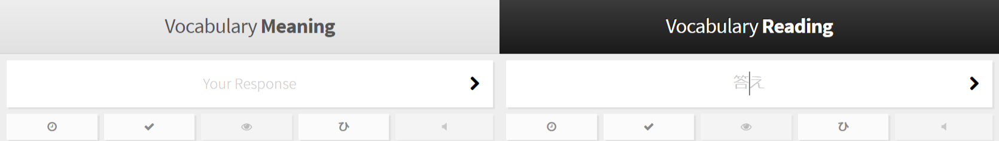
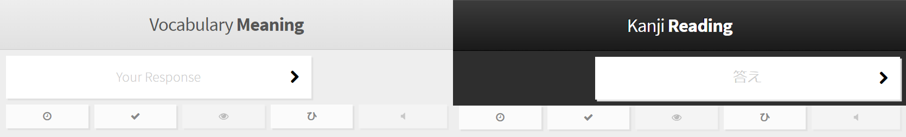

# Wanikani Hints

Help differentiate readings and meanings in Wanikani, an SRS flashcard application for learning Japanese kanji and vocabulary.

## Install

Wanikani Hints is published on GreasyFork.

Please install from the GreasyFork page: https://greasyfork.org/en/scripts/24536-wanikani-hints

## Details

This is a userscript, tested in Tampermonkey v4.0.59 on Google Chrome.

I wrote it because when I go through flashcard reviews too quickly in Wanikani, I start mixing up meanings and readings. It's very frustrating! This script applies some small style changes to make the difference between meanings and readings more visually apparent. If you want to apply other style changes based on meanings and readings, this userscript is also a good starting point.

## Before

## After

